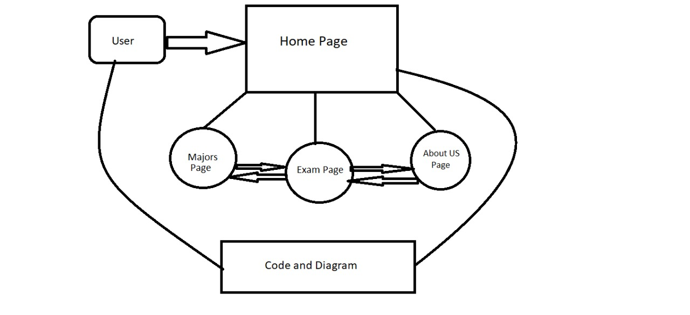

# Future-Road
# **IT-Army :**

### Ahmad Abu Zeid  |   Baha Aldeen Zghayar  | Haneen Khasawneh  | Tala Emad  |  Rana Shelbaya

 

**Name of Project**:
Future Road

 

**Summary :** 

The idea of our web site is to give the students after high school a background about main majors, and to let them not feeling lost to choose their major, by give him /her a general knowledge beyond the university level and give a sample about universities entrance exam. 

 

# User stories: 

* As a user i wanted more details about engineering and i found a great website that 
shows a useful video about engineering so that i can decide if it suits me or not

Feature tasks:
The user opened majors page then he clicked on an image, and popped up a 
video -using JavaScript- about a specific major which is related to the image. 

* As a user i wanted to know more details about universities entrance exams and i found useful links in this website. 
Feature tasks: 
The user opened exams page and he wanted to use another samples for the entrance exams by using HTML.

* As a user i wanted to prepare myself for universities entrance exams, and i took 3 exams in this website,
 which are english, math, and computer. 

Feature tasks: 
The user opened exams page and when he clicked on the exam button,
 it popped up and he solved the exam, and this was by using JavaScript and HTML. 

* As a user i want to navigate between the pages to see the content of this website about students. 

Feature tasks: 
The user opened the home page, majors page, and exams page, and this was by using HTML, CSS, and javaScript. 

* As a user i wanted to know most required jobs around the world.

Feature tasks: 
The user opened a page contains a chart that displays most required jobs around the world, and this was by HTML, CSS, and javaScript. 